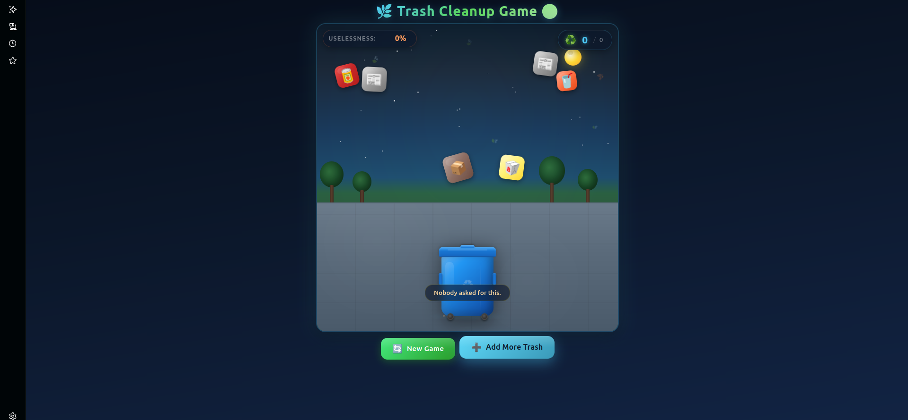
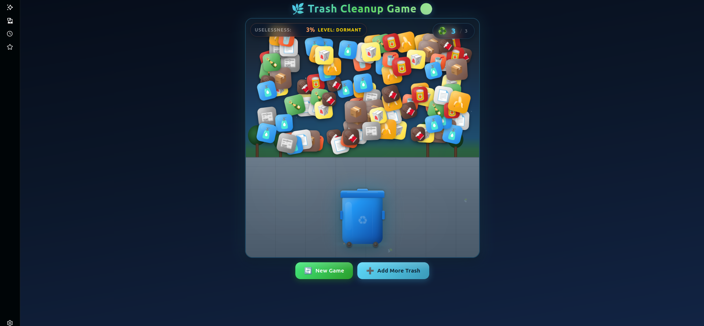
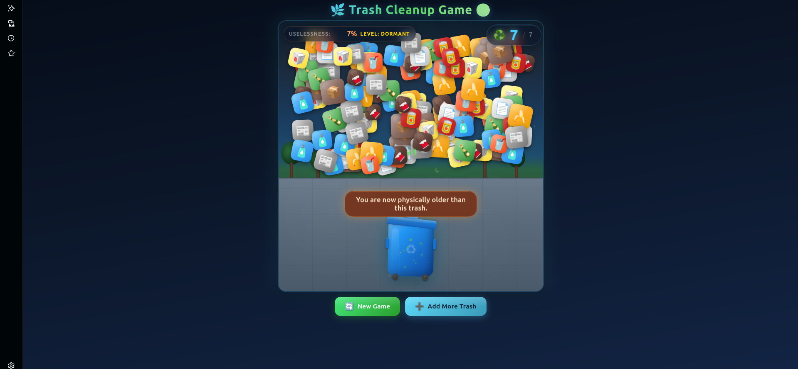

# 🗑️ Trash Cleanup Game 🌿

A fun browser-based game where a talking trash can collects waste and responds with hilarious roasts. Toss garbage into the bin, earn points, and enjoy witty comments that make cleaning up genuinely entertaining.

## Basic Details

### Team Name: Amigos

### Team Members
- Team Lead: [T.S. Anurudh] - [Ahalia School of Engineering and Technology]
- Member 2: [Kishore.K] - [Ahalia School of Engineering and Technology]

### Project Description
A fun browser-based game where a talking trash can collects waste and responds with hilarious roasts. Toss garbage into the bin, earn points, and enjoy witty comments that make cleaning up entertaining.

### The Problem (that doesn't exist)
Many people find learning about waste management boring and unengaging. Trash-talk-bot makes waste disposal fun by using humor and interactive gameplay to encourage cleaner habits.

### The Solution (that nobody asked for)
We solved this problem by creating an interactive game where the user disposes of waste in a virtual trash bin — complete with roasts, rejections, and self-aware commentary on the pointlessness of it all.

## Technical Details

### Technologies/Components Used
For Software:
- HTML5
- CSS3 (gradients, animations, layered scene)
- JavaScript (ES6+) — drag & drop, particle system, game loop
- Visual Studio Code, GitHub

For Hardware:
- None required — the entire project runs in the browser.

### Implementation
For Software:
# Installation
```
git clone https://github.com/your-username/your-repo-name.git
cd your-repo-name
```

# Run
Just open `index.html` in any modern browser. No build step, no dependencies, no server required.

### Project Documentation
For Software:

# Screenshots







For Hardware:
*Not applicable — this is a pure software project.*

### Project Demo
# Video
*Add your demo video link here.*

# Additional Demos
*Add any extra demo materials/links.*

## Features
- 🎨 Cartoon 3D-style visuals: layered park scene, stars, moon, trees, bushes, pavement
- 🗑️ Animated recycling bin with opening lid, wheels, handles, and recycling logo
- 🍌 10 recyclable trash types with randomized size/rotation/wobble
- 🖱️ Smooth drag & drop with touch support and scroll prevention
- 💬 Talking bin: roasts you on every throw, timed slow-collection roasts, and 20% rejection drama
- ✨ Particles, float scores, bin bounce, and celebration effects
- 📱 Fully responsive, mobile-friendly, `prefers-reduced-motion` aware
- 🧠 Meta toasts that mock the very existence of the project

## Team Contributions
- [T.S. Anurudh]: Game design, gameplay logic, scene/iteration polish
- [Kishore.K]: Trash/roast content, testing, and visual feedback tuning

---

Made with ❤️ at TinkerHub Useless Projects


